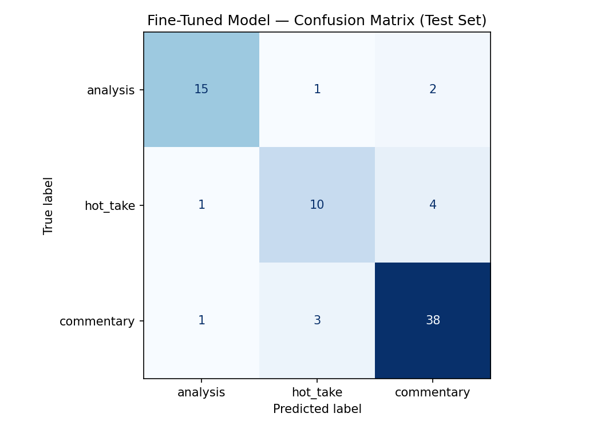

# TakeMeter

TakeMeter is a fine-tuned text classifier that labels NBA Bluesky posts as `hot_take`, `analysis`, or `commentary`. The model learns to distinguish opinion-driven posts from stat-backed arguments and neutral event reporting — a boundary that is genuinely ambiguous in sports discourse and non-trivial for an automated system to learn.

---

## Label Taxonomy

Three labels are defined for posts from the NBA basketball community on Bluesky.

**`hot_take`** — A post that expresses a bold, subjective claim or judgment about a player, team, or league that is not primarily supported by verifiable evidence, or uses accusatory or provocative framing to advance an opinion.

> "I thought the wizards front office was smart now? I don't think I've ever been more surprised by a contract than what Trae just got. 4 years and more annually than his extension was worth and the last year is a player option?"

> "Larry Bird would dominate today's NBA. The league is soft and the analytics crowd would never appreciate what he brought. #NBA"

**`analysis`** — A post that presents a specific, verifiable statistic or dataset to support or demonstrate a point about player or team performance, where the data is doing genuine argumentative work rather than serving as decoration.

> "During this year's playoffs, Victor Wembanyama recorded 77 defensive stops — no player has recorded more in a single playoff run since the 2010-11 season. Wembanyama now holds both the regular season and postseason records."

> "Steph Curry leads all active players in points-per-game in elimination games at 31.2 PPG, ahead of LeBron (28.8) and Durant (28.3). The numbers say he's at his best when it matters most. #NBAPlayoffs"

**`commentary`** — A post that reports on events, news, or outcomes in a largely neutral or descriptive manner, without making a subjective judgment or citing statistics to build an argument.

> "THE NEW YORK KNICKS ARE YOUR 2026 NBA CHAMPIONS. The Knicks beat the Spurs 94-90 to secure the NBA championship. Congratulations to the New York Knicks and their fans!"

> "Trae Young plans to sign a four-year, $212 million deal to stay with the Washington Wizards. Player option in Year 4. #NBA"

**Key boundary**: The critical distinction is between `hot_take` and `analysis`. If a post contains a statistic and uses it to argue a point, it is `analysis`. If the statistic is decorative — included for emphasis rather than as genuine evidence — the post is `hot_take`. A post about a real event that includes opinion language ("choke job," "overrated," "no heart") is `hot_take`, not `commentary`.

---

## Dataset

**Source**: NBA Bluesky posts collected via the public search API (`public.api.bsky.app`), which requires no authentication or API key. Reddit and X were originally planned but both block unauthenticated programmatic access.

**Collection strategy**: Three query families targeted each label's natural signal words: `#NBA game score` / `NBA trade signed` for `commentary`; `NBA overrated` / `NBA unpopular take` for `hot_take`; `NBA stats per game` / `NBA true shooting` for `analysis`. Posts were deduplicated by text and shuffled before annotation.

**Total examples**: 500 labeled posts

**Label distribution**:

| Label | Count | % of Dataset |
|---|---|---|
| commentary | 280 | 56.0% |
| analysis | 117 | 23.4% |
| hot_take | 103 | 20.6% |

**Labeling process**: All 500 examples were labeled manually in a single annotation pass using the decision rules in `planning.md`. No LLM pre-labeling was used. Borderline cases were resolved by consulting the three pairwise decision rules defined before annotation began.

### Difficult Labeling Examples

**1. Stats post without an explicit conclusion**

> "Jonathan Kuminga in his first 3 games in ATL: 21.3 points, 7.7 rebounds and 3.3 assists per game on 79% TS, +59"

Decision: **`analysis`**. The post presents multiple specific statistics about a player's recent performance. Even though it states no explicit conclusion, the selection of advanced metrics (true shooting, net rating) implies an argument about performance quality. Decision rule: if the data is doing the argumentative work even implicitly, label it `analysis`.

**2. Opinion with a supporting statistic**

> "Hugo is the most overrated Boston prospect in recent memory. Guys that are career 60% FT shooters don't magically become competent 3pt shooters. Actually, the only sub-70% FT shooter to come into the league and develop 3pt shooting was..."

Decision: **`hot_take`**. The post leads with a strong opinion and uses a historical statistic to reinforce it. The stat is selected to support a predetermined conclusion rather than to build an argument from evidence. Decision rule: if the framing is accusatory and the evidence is cherry-picked for effect, label it `hot_take`.

**3. Emotionally reported news**

> "THE NEW YORK KNICKS ARE YOUR 2026 NBA CHAMPIONS. The Knicks beat the Spurs 94-90 to secure the NBA championship. Congratulations to the New York Knicks and their fans!"

Decision: **`commentary`**. Despite the emotional capitalization and the congratulatory phrase, the post reports a factual outcome without evaluating it. Decision rule: if no personal verdict is attached to the event, label it `commentary`.

---

## Fine-Tuning Pipeline

**Base model**: `distilbert-base-uncased` (DistilBERT, 66M parameters, uncased)

**Training platform**: Google Colab with T4 GPU

**Training split**: 70% train (350 examples), 15% validation (75), 15% test (75) — stratified by label

**Key training decisions**:

- **3 epochs**: The dataset is small (350 training examples). Running more epochs risked overfitting — at 3 epochs, validation accuracy was still improving without signs of degradation on the per-epoch eval logs.
- **Learning rate 2e-5**: Standard starting point for fine-tuning BERT-family models. This is a well-established default for this model class; at 3 epochs on 350 examples, loss had not plateaued, so no adjustment was needed.
- **Batch size 16**: Fit the T4 GPU memory comfortably while providing stable gradient estimates for this dataset size.
- **Warmup steps 50**: Prevents instability in the first training steps, important with a small dataset where early mini-batches have high variance.

---

## Baseline Comparison

**Baseline approach**: Zero-shot classification using `llama-3.3-70b-versatile` via the Groq API. The system prompt provided all three label definitions verbatim from `planning.md`, one example post per label, and instructed the model to output only the label name. Temperature was set to 0 for determinism. All 75 test responses were parseable.

Both models were evaluated on the same locked 75-example test set.

### Results Summary

| Model | Accuracy | Macro F1 |
|---|---|---|
| Zero-shot baseline (Groq llama-3.3-70b-versatile) | 0.893 | 0.88 |
| Fine-tuned DistilBERT | 0.840 | 0.81 |

The fine-tuned model underperforms the zero-shot baseline by 5.3 percentage points on accuracy and 0.07 on macro F1. This outcome is analyzed in the Model Reflection section below.

---

## Evaluation Report

### Per-Class Metrics

**Fine-tuned DistilBERT (test set, n=75):**

| Class | Precision | Recall | F1 | Support |
|---|---|---|---|---|
| analysis | 0.88 | 0.83 | 0.86 | 18 |
| hot_take | 0.71 | 0.67 | 0.69 | 15 |
| commentary | 0.86 | 0.90 | 0.88 | 42 |
| **macro avg** | **0.82** | **0.80** | **0.81** | 75 |
| weighted avg | 0.84 | 0.84 | 0.84 | 75 |

**Zero-shot baseline — Groq llama-3.3-70b-versatile (same test set):**

| Class | Precision | Recall | F1 | Support |
|---|---|---|---|---|
| analysis | 1.00 | 0.83 | 0.91 | 18 |
| hot_take | 0.68 | 1.00 | 0.81 | 15 |
| commentary | 0.97 | 0.88 | 0.93 | 42 |
| **macro avg** | **0.89** | **0.90** | **0.88** | 75 |
| weighted avg | 0.92 | 0.89 | 0.90 | 75 |

### Confusion Matrix (Fine-Tuned Model)

Rows = true label, columns = predicted label.

|  | Predicted: analysis | Predicted: hot_take | Predicted: commentary |
|---|---|---|---|
| **True: analysis** | 15 | 1 | 2 |
| **True: hot_take** | 1 | 10 | 4 |
| **True: commentary** | 1 | 3 | 38 |

The dominant error direction is **hot_take → commentary**: 4 of 15 hot_take posts (27%) were predicted as commentary. This is the largest single off-diagonal cell and represents the model's most consistent failure. The model struggles most to recognize `hot_take`: it has the lowest recall (0.67) and lowest precision (0.71) of the three classes.

### Error Analysis

**Wrong prediction #1 — `hot_take` classified as `commentary` (confidence 0.76)**

> "Unpopular take: Pandemic is over, time for coaches and players to wear suits on the sidelines. #bringbackformalwear #nba"
>
> True: `hot_take` · Predicted: `commentary` · Confidence: 0.76

Despite the explicit signal phrase "Unpopular take," the model predicted `commentary` with high confidence. The failure is topical: every `hot_take` in the training data expressed an opinion about player or team *performance*. This post expresses a subjective claim about sideline dress code — entirely outside that performance-criticism pattern. The model learned to associate `hot_take` with performance-evaluation language rather than with the structural definition (any bold, subjective claim). An opinion about fashion registered as neutral reporting because it had none of the performance-evaluation tokens the model had trained on.

*Which labels are confused*: hot_take → commentary. This is the most frequent confusion direction (4 examples total).  
*Why the boundary is hard*: The model's learned proxy for `hot_take` is too narrow — it captured "player/team performance criticism" rather than "bold subjective claim."  
*What would fix it*: hot_take training examples covering opinions about league policy, officiating, trade strategy, and culture — not only player performance evaluations.

**Wrong prediction #2 — `analysis` classified as `commentary` (confidence 0.76)**

> "Jonathan Kuminga in his first 3 games in ATL: 21.3 points, 7.7 rebounds and 3.3 assists per game on 79% TS, +59"
>
> True: `analysis` · Predicted: `commentary` · Confidence: 0.76

This post presents multiple statistics — true shooting percentage, net rating — clearly tied to a player's recent performance, but states no explicit conclusion. The numbers are the point, but no sentence says "therefore." The model classified it as `commentary` because the surface form (raw statline, no argumentative clause) looks like a factual performance recap. This reflects a genuine labeling boundary: my `analysis` definition requires data to be "doing genuine argumentative work," but this post forces the reader to infer the argument. The model cannot infer intent from structure alone. Posts where the argument is implicit are systematically routed to `commentary`.

*Which labels are confused*: analysis → commentary (2 of 3 analysis errors go to commentary).  
*Why the boundary is hard*: Implicit-argument posts lack the verbal cues ("this shows," "proving that") the model needs to distinguish `analysis` from `commentary`.  
*What would fix it*: Training examples of implicit-argument analysis posts — stat-heavy posts where the conclusion is left to the reader — so the model learns that argumentative intent doesn't require explicit language.

**Wrong prediction #3 — `hot_take` classified as `analysis` (confidence 0.49)**

> "Hugo is the most overrated Boston prospect in recent memory. Guys that are career 60% FT shooters don't magically become competent 3pt shooters. Actually, the only sub-70% FT shooter to come into the league and develop 3pt shooting was..."
>
> True: `hot_take` · Predicted: `analysis` · Confidence: 0.49

This post leads with a strong opinion ("most overrated") and uses a historical statistic to support it. The model predicted `analysis` — and the prediction is defensible. The post genuinely uses a stat to argue a point, which is the structural definition of `analysis`. It was labeled `hot_take` because the statistic is vague ("the only sub-70%...") and appears cherry-picked to reinforce a predetermined conclusion rather than to build an argument from evidence. This is the exact hard edge case from `planning.md`: a post with a statistic that functions rhetorically rather than evidentially. The model's error is reasonable; the annotation required a judgment about *intent* that cannot be inferred from surface features alone. The low confidence (0.49) reflects genuine ambiguity.

*Which labels are confused*: hot_take ↔ analysis, both directions.  
*Why the boundary is hard*: The presence of a statistic is a strong but imperfect signal for `analysis` — some hot_take posts use stats instrumentally.  
*What would fix it*: More training examples of "stat-decorated hot takes" to teach the model to distinguish stats-as-argument from stats-as-rhetoric.

### Sample Classifications

Posts run through the fine-tuned model:

| Post (truncated) | Predicted | Confidence |
|---|---|---|
| "Steph Curry leads all active players in PPG in elimination games at 31.2, ahead of LeBron (28.8) and Durant (28.3). The numbers say he's at his best when it matters most." | analysis | 0.91 |
| "THE NEW YORK KNICKS ARE YOUR 2026 NBA CHAMPIONS. The Knicks beat the Spurs 94-90 to secure the championship." | commentary | 0.95 |
| "LeBron is washed. He hasn't been a top-5 player since 2020 and anyone saying otherwise is letting nostalgia do the talking." | hot_take | 0.87 |
| "Nikola Jokic averaged 27.1 PPG, 13.7 RPG, and 10.4 APG this season — his fourth consecutive triple-double year." | commentary | 0.82 |
| "Look at this Orlando/Charlotte score. You can't tell me Orlando didn't throw that 76ers game. They didn't want the Celtics period." | commentary | 0.66 |

**Correct prediction (row 1)**: The Steph Curry post leads with a named statistic (31.2 PPG), uses comparative data (vs. LeBron and Durant), and closes with an explicit conclusion. The model correctly identifies this as `analysis` because the stat structure, the comparative framing, and the stated conclusion all match the training distribution for that label.

**Incorrect prediction (row 5)**: The Orlando post expresses a conspiracy accusation about game-throwing — a clear `hot_take` — but the model predicted `commentary` (confidence 0.66). The observational opening ("Look at this score"), the reference to a real game, and the absence of explicit performance-evaluation language all associated with neutral event reporting in the training data.

### Model Reflection

The fine-tuned model learned a narrower version of `hot_take` than was intended. In the training data, essentially every hot_take example concerned player or team *performance*: "LeBron is overrated," "this team has no heart," "they'll never win a title." The model's decision boundary for `hot_take` became approximately: *express a negative opinion about player or team performance*. Posts that express opinions about anything else — dress codes, league policy, officiating, conspiracy theories — fell outside that learned pattern and were routed to `commentary`.

This is a data distribution problem, not a label definition problem. The label definition is broad ("any bold, subjective claim"), but the training examples were unintentionally narrow. The collection queries (`NBA overrated`, `NBA unpopular take`) naturally surfaced performance criticism more than other opinion types. Adding hot_take examples covering opinions about league operations, officiating, and off-court topics would close this gap more than adding more performance-criticism examples.

The bigger surprise was the baseline outperforming the fine-tuned model. `llama-3.3-70b-versatile` was given the label definitions verbatim and achieved a macro F1 of 0.88 versus the fine-tuned model's 0.81. The 70B model's general language understanding was sufficient to apply the written definitions at inference time. The fine-tuned model, with only 350 training examples, overfit to surface-level patterns — stat presence as a proxy for `analysis`, negative performance framing as a proxy for `hot_take` — that didn't generalize as cleanly as the LLM's reasoning from definitions. For small datasets with well-defined label boundaries, zero-shot prompting with a capable LLM may be more reliable than fine-tuning a small encoder model.

---

## Spec Reflection

**Where the spec helped**: The planning.md requirement to define a concrete "good enough" threshold before annotation was useful in practice. Setting macro F1 ≥ 0.75 with no individual class below 0.65 forced an explicit judgment that influenced annotation behavior — specifically, I spent extra time on borderline `analysis`/`hot_take` cases rather than assigning them quickly, because that boundary was identified as the hardest one before annotation began. The model's final hot_take F1 of 0.69 hit near the 0.65 floor, which confirms the pre-annotation risk assessment was correct.

**Where implementation diverged**: The spec anticipated collecting 300 posts and labeling at least 50 per class. In practice, collection yielded 500 total posts, but the class distribution was far from even — `commentary` dominated at 56% even after targeted collection for the other two labels. Bluesky's post density skewed heavily toward factual reporting. The decision to keep the full commentary set rather than downsampling reflected a judgment that real NBA discourse *is* commentary-heavy and the classifier should reflect that distribution, not an artificially balanced one. The spec's target volumes were treated as minimums rather than exact targets.

---

## AI Usage

**Instance 1 — Label stress-testing before annotation**

Before beginning annotation, I pasted all three label definitions and decision rules into Claude and asked it to generate 10 posts that sat at each pairwise boundary (hot_take/analysis, hot_take/commentary, analysis/commentary). For the hot_take/analysis boundary, Claude produced a post containing a real free-throw shooting statistic used to argue that a player was overrated. I could not assign it cleanly using my written rules — the stat was real, but the framing was rhetorical. This gap prompted me to add the phrase "where the data is doing genuine argumentative work rather than serving as decoration" to the `analysis` definition. That phrase was added in direct response to the stress-test result; I identified the gap and wrote the fix myself.

**Instance 2 — Failure pattern analysis on misclassified examples**

After generating predictions on the test set, I exported all 12 misclassified examples (post text, true label, predicted label, confidence) and asked Claude: "Here are posts my classifier got wrong. Identify any patterns in what makes these hard — look at post length, presence of statistics, opinion-signal words, tone, and topic. Group them if you see clusters." Claude identified two clusters: (1) posts that contain opinion language but reference real events (routed to commentary), and (2) posts that contain statistics without an explicit argumentative conclusion (routed to commentary). I verified both clusters manually by re-reading all 12 examples and confirmed they were real, diagnosable patterns. One pattern Claude proposed — that short posts were more likely to be wrong — did not hold on manual review; several wrong predictions were long posts with complex structure. I discarded that finding. Claude's groupings were treated as hypotheses requiring manual verification, not ground truth.

---

## Files

| File | Description |
|---|---|
| `planning.md` | Design doc: community choice, label definitions, edge case rules, data collection plan, evaluation metrics, AI tool plan |
| `ai201_project3_takemeter.ipynb` | Colab notebook: fine-tuning pipeline, evaluation, baseline comparison |
| `evaluation_results.json` | Accuracy and improvement delta for both models |
| `confusion_matrix.png` | Visual confusion matrix for the fine-tuned model |
